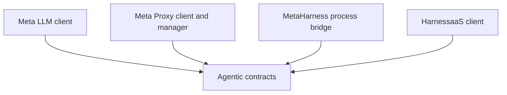

# ADR 0019: Agentic Platform Bounded Contexts and SDK Topology

- **Status:** Partially Implemented
- **Date:** 2026-07-18
- **Updated:** 2026-07-19 — the shared `agentic` module (bounded-context boundary, product-private client rule) is built and frozen across all 3 languages (PRs #79, #82, #83, #84); Meta LLM (ADR-0024a) and Meta Proxy (ADR-0025a D1-D10 tractable scope) client boundaries are implemented as separate product-private clients per this ADR's topology. MetaHarness and HarnessaaS contexts are not yet started. **HarnessaaS gateway-contract reconciliation audit (issue #67), re-run against a fresh clone of `cognitum-one/harnessaas`:** the cited baseline `908e4a99332617fd321d6f23a1d5a70e07413ffa` is CONFIRMED to still be the current upstream `HEAD` (`git log -1`, 87 commits total, none newer than 2026-07-09) — the commit hash was not actually stale. The specific claim below (checked-in gateway spec still describes Google ID-token auth; live source implements `cog_`-key tenant auth) is RECONFIRMED accurate line-for-line against that same HEAD. What this ADR's one-line table summary ("Solve, lineage, receipt, conformance, and evolving job APIs") understates: the live route surface is materially broader than `/solve` + `/lineage/{request_id}` — it also serves `GET /health`/`/healthz`/`/status` (`src/server.ts:286-304`), a full webhook admin surface (`POST`/`GET`/`DELETE /webhooks`, `GET /webhooks/:id/deliveries`, `GET /webhooks/public-key` — ADR-0031, `src/server.ts:306-340`), a MicroLoRA flywheel API (`POST /microlora/run`, `GET /microlora/status`, `GET /microlora/lineage/:id` — ADR-0032, `src/server.ts:503-508`), and an authenticated `/api/v1/*` relay for IBO-console/meta-capabilities (`src/server.ts:342-365`) — none of which appear in `config/api-gateway.openapi.yaml`, which remains a stale, single-route (health/solve/lineage), Google-ID-token Swagger 2 scaffold never wired to the real service. `POST /solve` itself is confirmed genuinely synchronous (one HTTP request/response, no job/poll/SSE contract) — see the ADR-0027a context-section note below. Full findings posted to issue #67.
- **Deciders:** Cognitum SDK Working Group, MetaHarness owner, Meta LLM owner, Meta Proxy owner, HarnessaaS owner, Security
- **Scope:** cross-cutting (`sdks/node`, `sdks/python`, `sdks/rust`)

## Context

The Cognitum SDK family currently exposes the cloud control plane and Seed
clients. It does not expose MetaHarness, Meta LLM, Meta Proxy, or HarnessaaS.
Those products are related, but they are not interchangeable transports:

| Product | Bounded context | Deployment | Trust boundary | Current protocol |
|---------|-----------------|------------|----------------|------------------|
| `npx metaharness` | Local harness factory and verifier | User workstation or CI | Local process, repository, package registry | CLI plus a TypeScript programmatic surface |
| Meta LLM | Hosted model serving and model governance | Cognitum or customer control plane | Remote multi-tenant service | OpenAI-compatible, Anthropic-compatible, and Cognitum platform HTTP APIs |
| Meta Proxy | Local inference routing data plane | Loopback sidecar | Local bearer token, OAuth/API-key stores, routing consent | A strict subset of inference HTTP APIs plus status and reload |
| HarnessaaS | Governed task execution | Remote execution plane | Untrusted repository and command execution | Solve, lineage, receipt, conformance, and evolving job APIs |

The reviewed public `metaharness` source manifest reports version `0.4.1`,
requires Node 20, exposes two binaries, and exports a scaffold API
(`ruvnet/metaharness@072b95c0:packages/create-agent-harness/package.json:2-3,22-26,121`).
The npm registry still publishes `0.4.0` at the 2026-07-18 audit; source version
and published distribution identity are therefore deliberately reported
separately.
Its supported host and template catalogs are source-defined
(`packages/create-agent-harness/src/index.ts:63-89`). The separate
`@metaharness/sdk` currently defines harness configuration objects; it is not a
language-neutral runtime protocol (`packages/sdk/src/index.ts:74-124`).

Meta LLM registers both standard inference routes and Cognitum governance
routes. Examples include models, chat, messages, responses, batches, pods,
usage, embeddings, and vectors
(`cognitum-one/meta-llm@948bd31a:src/server.ts:72-119`). Meta Proxy is a local
foreground Rust process at `127.0.0.1:11435`, with an authenticated `/status`
endpoint and a narrower inference surface
(`cognitum-one/meta-proxy@43427e92:README.md:59-62,198-223,273-278`). It must
not be assumed to implement every Meta LLM route.

HarnessaaS accepts a repository and customer-supplied `test_command`, and
returns a solve result with lineage and conformance evidence
(`cognitum-one/harnessaas@908e4a99:src/types.ts:557-567,786-870`). Its checked-in
gateway document covers only `/solve` and `/lineage/{request_id}` and still
describes Google ID-token authentication
(`config/api-gateway.openapi.yaml:16-37,66-85`), while current source contains
newer tenant and API-key behavior. The SDK cannot safely generate bindings from
that document without first reconciling the contract.

**2026-07-19 reconciliation audit (issue #67):** re-cloned `cognitum-one/harnessaas`
and re-verified this paragraph against the live upstream `HEAD`. The `908e4a99`
baseline is still `HEAD` (no commits since 2026-07-09) — not actually stale.
`src/auth.ts:1-24,77` and `src/server.ts:262-274` confirm inbound auth is a
SHA-256-hashed `cog_` API key (`X-API-Key` / `Authorization: Bearer`) resolved to
a per-tenant `TenantContext`, exactly as this paragraph already stated — Google
ID-token auth exists only in the unused `config/api-gateway.openapi.yaml`
scaffold. The live route surface is wider than "Solve, lineage, receipt,
conformance" implies: `GET /health`/`/healthz`/`/status` (`src/server.ts:286-304`),
webhook admin routes (ADR-0031, `src/server.ts:306-340`), a MicroLoRA flywheel API
(ADR-0032, `src/server.ts:503-508`), and an `/api/v1/*` IBO-console/meta-capabilities
relay (`src/server.ts:342-365`) all now exist and are authenticated the same way,
but none appear in the checked-in gateway document. `POST /solve` is confirmed
GENUINELY SYNCHRONOUS — one HTTP request returns the full `SolveResponse` inline;
there is no job/poll/SSE/approval contract in the running service (see ADR-0027a's
context section, which already documents this gap and proposes to close it).

The existing topology decision in ADR-0011 rejects a single god client and
uses subpaths, submodules, and Rust features to keep trust and dependency
boundaries explicit. The new integrations must retain that property.

### Source review baseline

This series was written against immutable revisions so later drift can be
measured:

| Repository | Baseline revision |
|------------|-------------------|
| `cognitum-one/sdks` | `bccae6a3bfd8e0a59bc251738bf992852917a00f` |
| `ruvnet/metaharness` | `072b95c0a74610de008dca5473343a81619cef20` |
| `cognitum-one/metaharness` | `fc8845f3bfdb67f1ab6d99547cc98e3b57717029` |
| `cognitum-one/meta-llm` | `948bd31a67a6daf3cf5888e06be64e732027be13` |
| `cognitum-one/meta-proxy` | `43427e92ee0527413ca71744b538035537e0b6ef` |
| `cognitum-one/harnessaas` | `908e4a99332617fd321d6f23a1d5a70e07413ffa` |

## Decision

Add four independent bounded-context clients to the existing SDK package
family. Share value types, error mapping, credential-provider interfaces,
stream parsing, operation handles, and evidence verification. Do not share
product lifecycle, infer capabilities from a base URL, or add the four products
as eagerly-created properties on the existing `Cognitum` cloud client.

### D1. Ubiquitous language

The SDK and documentation MUST use these terms consistently:

| Term | Meaning | Must not mean |
|------|---------|---------------|
| Harness definition | Declarative agents, skills, tools, hooks, and MCP servers | A hosted execution job |
| Harness workspace | Files generated or inspected by MetaHarness | A remote HarnessaaS tenant |
| Model request | Chat, message, response, completion, or embedding request | A HarnessaaS solve |
| Routing plane | Meta Proxy's chosen passthrough, cloud, local, or sponsored path | A Meta LLM model tier |
| Operation | A server-owned asynchronous batch, pod, or solve | A local child process |
| Process run | A locally-owned MetaHarness invocation | A durable remote operation |
| Receipt | Structured cost and execution evidence | A provider's unverified usage estimate |
| Lineage | Verifiable chain linking inputs, decisions, artifacts, and outcomes | Debug logs |
| Capability | Runtime-advertised, versioned support for a named behavior | A feature guessed from package version |

### D2. Public namespace map

The following is the normative package topology. Names may only change before
this ADR is accepted; after acceptance, they follow ADR-0006 compatibility
rules.

| Context | Node | Python | Rust module and feature |
|---------|------|--------|-------------------------|
| Shared agentic contracts | `@cognitum-one/sdk/agentic` | `cognitum.agentic` | `cognitum_one::agentic`, default |
| Meta LLM | `@cognitum-one/sdk/meta-llm` | `cognitum.meta_llm` | `cognitum_one::meta_llm`, `meta-llm` |
| Meta Proxy | `@cognitum-one/sdk/meta-proxy` | `cognitum.meta_proxy` | `cognitum_one::meta_proxy`, `meta-proxy` |
| MetaHarness | `@cognitum-one/sdk/metaharness` | `cognitum.metaharness` | `cognitum_one::metaharness`, `metaharness` |
| HarnessaaS | `@cognitum-one/sdk/harnessaas` | `cognitum.harnessaas` | `cognitum_one::harnessaas`, `harnessaas` |

Python modules MUST remain lazy imports. Rust product features MUST be
independently selectable. Node subpaths MUST avoid importing child-process or
filesystem modules into browser-safe Meta LLM and HarnessaaS bundles.

### D3. Client ownership and construction

Each context has an explicit client and configuration object:

```text
MetaLlmClient       owns remote model and governance HTTP state
MetaProxyClient     talks to an already-running loopback proxy
MetaProxyManager    explicitly discovers, installs, starts, and stops the sidecar
MetaHarnessClient   owns a local, structured child-process bridge
HarnessAasClient    owns remote governed-operation HTTP state
```

Constructing one client MUST NOT construct, install, start, authenticate, or
probe another product. Constructors MUST be side-effect free. Network and
process probes happen only through explicit `capabilities()`, `status()`, or
operation methods.

A convenience `AgenticClients` configuration builder MAY be added after the
four clients pass conformance. It MUST be a holder of explicit clients, not a
router and not a second policy engine.

### D4. Dependency direction

The allowed dependency graph is:



Product modules MUST NOT import one another. Applications may compose them.
The private `cognitum-one/metaharness` product may also compose them, but its
commercial router, brain, optimization, and UI policy do not move into the
general-purpose SDK.

A cross-product adapter is permitted only when both products depend on a small
interface in `agentic`, the provider implementation lives in its owning product
subpath, and the application injects it. The consumer product still has no
direct import. ADR-0025b's MetaHarness-backed Proxy lifecycle provider is the
initial case.

### D5. Shared versus product-specific contracts

The shared `agentic` namespace is deliberately small:

- `CapabilitySet` and protocol/version negotiation
- `RequestContext` with request ID, correlation ID, idempotency key, timeout,
  abort/cancellation signal, and optional tracing carrier
- common error base and retry classification
- `OperationHandle`, `OperationState`, and wait options
- `ExecutionReceipt`, `LineageReference`, and verification result
- credential-provider and secret-redaction interfaces
- transport-neutral pagination and event-stream primitives

The following MUST remain product-specific:

- Meta LLM routing, tier, safety, cache, and model response metadata
- Meta Proxy plane selection, consent, status, install, and local token state
- MetaHarness host, template, scaffold, diagnostic, score, sign, and verify
  commands
- HarnessaaS solve input, oracle, patch, conformance, sandbox, and vertical task
  types

This prevents a nominally shared type from erasing security-significant fields.

### D6. Capability negotiation is mandatory

Every client MUST expose `capabilities() -> CapabilitySet`. A capability set
contains at least:

```json
{
  "product": "meta-llm",
  "product_version": "0.0.0",
  "protocol": "cognitum.meta-llm.http",
  "protocol_version": "1.0",
  "features": {},
  "limitations": [],
  "auth_methods": [],
  "source": "server|static-compatibility-table"
}
```

Until a product publishes a runtime capabilities endpoint or structured bridge,
the SDK may use a checked-in compatibility table keyed by exact tested version.
Unknown versions receive the intersection of proven-safe capabilities, never
the union. A method whose prerequisite capability is false or unknown MUST fail
locally with `UnsupportedCapabilityError` before causing spend, mutation,
consent, or code execution.

### D7. Transport reuse has a hard limit

Meta LLM and Meta Proxy share OpenAI and Anthropic wire primitives where their
capability sets agree. They do not share a client class. In particular:

- changing `MetaLlmClient.base_url` to the proxy URL is unsupported;
- Meta LLM governance methods are never sent to Meta Proxy;
- Meta Proxy routing plane and consent metadata are preserved rather than
  normalized into Meta LLM tier metadata;
- supported headers are selected by the target contract, not forwarded
  optimistically;
- sponsored requests are explicit Proxy methods and cannot be selected by an
  SDK retry or fallback.

### D8. Release maturity

Each method is labeled `stable`, `preview`, or `internal` in the contract
manifest:

| Maturity | Public SDK behavior |
|----------|---------------------|
| Stable | Available in normal namespace and subject to SemVer |
| Preview | Available only through an explicit preview option/feature and may change in a minor release before 1.0 |
| Internal | No public binding |

Presence in source code is not sufficient for stable SDK exposure. Product
owners must publish the contract, auth scope, tenant rules, idempotency behavior,
and at least one conformance fixture.

### D9. Business outcomes and decision metrics

This topology is intended to turn four separate product integrations into one
governable developer platform without weakening each product's commercial or
security boundary. Success is measured by executable outcomes rather than route
count:

| Outcome | Release metric |
|---------|----------------|
| Faster adoption | A new user completes a fixture-backed remote Meta LLM or HarnessaaS quick start in 15 minutes or less, and a local MetaHarness/Proxy quick start in 30 minutes or less, without reading internal repositories |
| Cross-language reach | Every advertised stable operation passes the same semantic fixture in Node, Python, and Rust |
| Monetization integrity | Zero duplicate charge or execution in the idempotency fault matrix; payer, tier, plane, and cost provenance survive every response |
| Enterprise governance | Zero credential, prompt, source, or artifact canaries in normal telemetry; every consent and isolation gate fails closed |
| Lower support cost | Compatibility, maturity, limitations, and tested product revisions are generated from the contract lock instead of maintained in conflicting prose |
| Independent product velocity | A preview or blocked capability in one product does not prevent a conformant stable method in another product from releasing |

These are release acceptance metrics, not forecasts of revenue or adoption.
They give Product and Engineering a common definition of value while preserving
honest maturity labels.

## Consequences

### Positive

- Users gain one discoverable SDK family without collapsing local and remote
  trust boundaries.
- A shared inference codec can reduce duplicated protocol code while capability
  checks prevent false proxy parity.
- Products can evolve independently and publish preview functionality without
  destabilizing the root cloud client.
- Commercial MetaHarness can compose the same public clients without forcing
  its policy into every SDK consumer.

### Negative and trade-offs

- Five top-level client concepts, including the existing cloud client, are more
  verbose than a god client. The verbosity makes credentials, spend, consent,
  and process ownership reviewable.
- Capability manifests add an upstream publication and SDK synchronization
  burden. This is estimated at one to two engineering days per product release.
- Cross-language parity is measured at the domain behavior level, not identical
  syntax, so conformance fixtures become mandatory.

### Biggest failure mode and mitigation

The biggest failure mode is treating all four products as interchangeable
"harness" endpoints, then silently routing an unsupported, billable, or unsafe
operation through the wrong trust boundary. The mitigation is independent
clients, side-effect-free construction, a deny-by-default dependency graph, and
capability checks before every nontrivial operation.

## Alternatives considered

| Option | Pros | Cons | Why rejected |
|--------|------|------|--------------|
| Add all resources to `Cognitum` | Single entry point | Couples credentials, runtimes, browser support, consent, and lifecycle | Repeats the god-client design rejected by ADR-0011 |
| Treat Meta Proxy as a Meta LLM base URL | Smallest API | Proxy is a strict subset and has distinct plane/consent behavior | Would produce false feature parity and unsafe fallback assumptions |
| Ship four standalone package families | Maximum release isolation | Brand fragmentation, duplicated contracts, difficult discoverability | Existing subpath/submodule/feature pattern already solves dependency isolation |
| Bind private Cognitum MetaHarness only | One commercial integration | Hides the public `npx metaharness` workflow and couples SDKs to product policy | User requirement is the public local tool plus the three services |
| Parse current implementations independently in each language | Fast first binding | Guaranteed contract drift and inconsistent security decisions | ADR-0020 establishes neutral contracts and shared fixtures |

## Compliance and verification

CI MUST enforce all of the following:

1. Import smoke tests prove each product namespace loads without constructing or
   probing any other product.
2. Node bundle tests prove importing Meta LLM or HarnessaaS does not include
   child-process or filesystem code.
3. Rust builds every product feature alone and in all-features mode.
4. Python import tests prove product modules are lazy.
5. A deny-list test fails if a product module imports another product module.
6. Capability tests prove unknown product versions fail closed for mutation,
   spend, consent, installation, and code execution.
7. A proxy test proves an unsupported Meta LLM governance call is rejected
   locally and never reaches `/v1/*` on the proxy fixture.

**Issue #74 reconciliation note (this test suite pass):** item 3 is already fully
CI-enforced today and is deliberately NOT duplicated as a source-level test.
`.github/workflows/ci.yml`'s `rust-feature-matrix` job builds `cognitum-one` with
each of `default`, `native-tls`, `seed`, `stream`, `blocking`, `mdns`, `meta-llm`,
`meta-proxy`, `metaharness`, and `harnessaas` enabled ALONE (one job per feature),
and the `rust` job separately builds, tests, and clippies the crate with every
feature except `live-seed-tests` enabled together (all-features mode for this
ADR's purposes). Items 1, 5, 6, and 7 are implemented as real automated tests in
each of `sdks/node/tests/adr-0019-*.test.ts`, `sdks/python/tests/test_adr0019_*.py`,
and `sdks/rust/tests/adr_0019_*.rs`; item 2 (Node-only) and item 4 (Python-only)
likewise. See the closing "Acceptance test" paragraph below, implemented
identically as `adr-0019-acceptance.test.ts` / `test_adr0019_acceptance.py` /
`adr_0019_acceptance.rs`.

### Acceptance test

For each of Node, Python, and Rust, instantiate all four clients with fake local
transports and distinct sentinel credentials. Assert zero I/O during
construction, assert each client sends only its own credential to its own
fixture, assert an unknown capability blocks a billable mutation before I/O,
and assert importing one namespace does not load another product implementation.

## References

- ADR-0003: cross-cutting authentication model
- ADR-0004: cross-cutting error taxonomy
- ADR-0005: cross-cutting retry and backoff
- ADR-0006: cross-cutting versioning
- ADR-0007: cross-cutting security model
- ADR-0011: SDK scope, cloud control plane versus Seed direct
- ADR-0020: contract source of truth and generation
- ADR-0022: agentic authentication, tenant, budget, secret, and consent isolation
- ADR-0029: language packaging, features, and CLI boundaries
